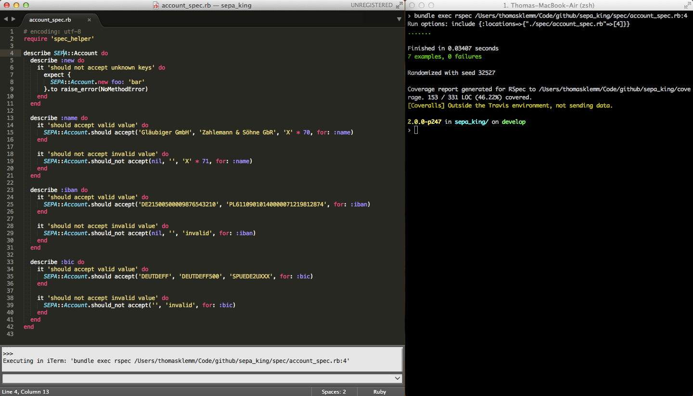

# SublimeToConsole

Send commands from Sublime Text 3 to the console. Great for running specs while staying in Sublime.

Currently it sends `"bundle exec #{current_file}:#{current_line_number})"` to a terminal of your choice (Terminal.app or iTerm).

### Usage

Press **`alt + r`** to run the specs your currently working in the terminal. 

It sends a `"bundle exec #{current_file}:#{current_line_number})"`, so depending on where the cursor is, a single one or a group of specs start running in the background. 

### Troubleshooting

Note that you need to `cd` into the repository if you get `Could not locate Gemfile` errors.

### Thanks

[Winston Chang (@wch)](https://github.com/wch) for [SendText](https://github.com/wch/SendText), a great source for building this plugin.

### Licence

MIT, (c) 2014 Thomas Klemm